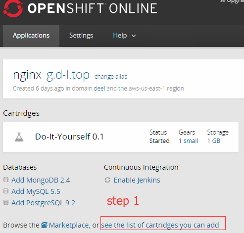
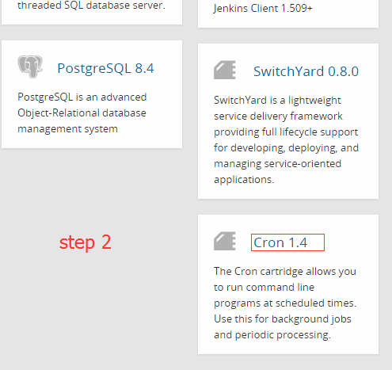
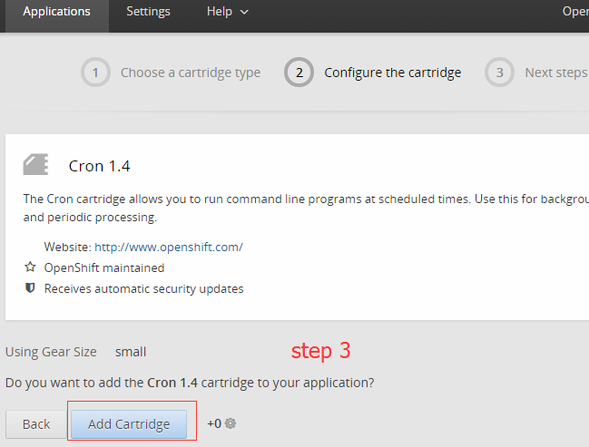
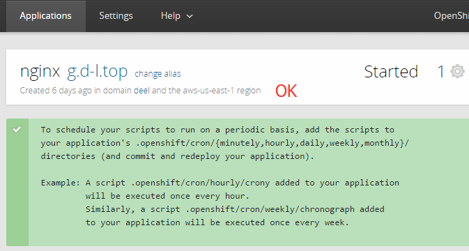

# 部署前准备工作

如果你已经有一个openshift的二级域名mydomain, 形如 http://xxx-mydomain.rhcloud.com, 并且自己的开发环境中已经安装: rhc, git, ssh client 等工具，可以忽略步骤1~3.

相关的中文图文教程可以参考[这篇文章](http://www.freehao123.com/openshift-redhat-ssh/)的“一 登录准备条件”、“二 转换授权Key”、“三 Putty登录” 3个步骤。

1. 首先你得有个 openshift 账号
2. 按照 [openshift 用户文档](https://access.redhat.com/documentation/en-US/OpenShift_Online/2.0/html/User_Guide/index.html), 在自己的PC上安装以下工具:
	1. rhc
	2. git
	3. ssh 客户端
	
	参考资料： [openshift - Installing Client Tools](https://access.redhat.com/documentation/en-US/OpenShift_Online/2.0/html/Client_Tools_Installation_Guide/sect-Installing_Client_Tools.html)
3. 配置好你的openshift账号. 包括：
	* [SSH Keys](https://access.redhat.com/documentation/en-US/OpenShift_Online/2.0/html/User_Guide/Generating_Keys_Manually4.html)
	* 创建二级openshift域名: [Creating a Domain](https://access.redhat.com/documentation/en-US/OpenShift_Online/2.0/html/User_Guide/sect-Domain_Management.html#Creating_a_Domain)
		
		形如 'http://Appname-DomainName.rhcloud.com' 的创建：

		`rhc domain create DomainName`，

		这样你后面就可以使用 `rhc app create` 命令来创建app了.

		这里以我的配置为例: 

			1. app url: http://nginx-deel.rhcloud.com/
			2. 二级openshift域名: deel
			3. app名： nginx

4. 创建一个 名字为 nginx 的 app, 方案类型为 diy-0.1
	<pre>
	$ rhc app create nginx diy-0.1
	Your application 'nginx' is now available.
	  URL:        http://nginx-deel.rhcloud.com/
	  SSH to:     xxxxxxxxxxxxxxx@nginx-deel.rhcloud.com
	  Git remote: ssh://xxxxxxxxxxxxxx@nginx-deel.rhcloud.com/~/git/nginx.git/
	</pre>
	将回显信息记录下来，后面会用到 url, ssh 地址, git remote地址 。
5. 查看刚刚创建的 nginx app
	<pre>
	$ rhc app show -a nginx
	</pre>

	浏览器访问它给的 url: http://nginx-deel.rhcloud.com/, 说明已经有一个默认的服务器软件"ruby server"在运行了。

	注意第一段话：
	> Do-It-Yourself is an experimental cartridge that provides a way to try unsupported languages, frameworks, and middleware on OpenShift. To get started, add your framework of choice and modify .openshift/action_hooks/{start, stop} to start and stop your application. The only restriction is that your application should bind to $OPENSHIFT_DIY_IP:8080 Don't forget to stop the existing server that is running before you push your stop file.

	大概意思就是，在你仓库代码中，你可以更改app的启动和停止脚本，路径为.openshift/action_hooks/{start, stop}

	还说了两条限制：
	1. 你的服务器软件要绑定在$OPENSHIFT_DIY_IP:8080
	2. 在你把你修改过后的stop脚本 `git push` 到远程仓库之前，别忘了先关停现在正在运行着的服务器软件。

6. git clone
	<pre>
	$ # git clone <git_url> <directory_to_create>
	$ git clone ssh://xxxxxxxxxxx@nginx-deel.rhcloud.com/~/git/nginx.git/ openshift_nginx
	$ cd openshift_nginx
	</pre>
	将远程仓库clone下来.
	<pre>
	$ git config user.email "deel@d-l.top"
	$ git config user.name "Deel"
	</pre>
	配置一下git。 email 和 name 的值写你自己的，也可以随便写。

7. 到远程主机关停正在运行的默认服务器软件"ruby server"。
	<pre>
	$ ssh xxxxxxxxxxxxxxx@nginx-deel.rhcloud.com

	$ /usr/bin/gear stop
	或者执行
	$ bash $OPENSHIFT_REPO_DIR/.openshift/action_hooks/stop
	</pre>
	如果此步被忽略，会造成端口占用错误。 

8. 在openshift上添加定时任务支持

	很简单， 登录到 [openshift](https://openshift.redhat.com/app/console/applications), 点进去你刚刚创建的app.
	
	完成下列图示步骤, 以我的情况为例：

	

	
	
	

	
